# Decentraland UI utils library

A collection of tools for common UI requirements for Decentraland scenes.

- [Using the UI utils library](#using-the-ui-utils-library)
- [Text Announcement](#text-announcement)
- [Counter](#counter)
- [Corner Labels](#corner-labels)
- [Bar](#bar)
- [Corner Icons](#corner-icons)
- [Loading icon](#loading-icon)
- [Large image](#large-image)
- [Predefined prompt windows](#predefined-prompt-windows)
  - [Ok Prompt](#ok-prompt)
  - [Option Prompt](#option-prompt)
  - [Fill in Prompt](#fill-in-prompt)
- [Custom Prompt Windows](#custom-prompt-windows)
  - [Create a custom prompt](#create-a-custom-prompt)
  - [Customizing close button](#customizing-close-button)
  - [Add text](#add-text)
  - [Add a button](#add-a-button)
  - [Add a Checkbox](#add-a-checkbox)
  - [Add a Switch](#add-a-switch)
  - [Add an icon](#add-an-icon)
  - [Add an input box](#add-an-input-box)
  - [Full Custom UI example](#full-custom-ui-example)
- [Contribute](#contribute)
- [CI/CD](#cicd)

## Using the UI utils library

To use any of the helpers provided by the utils library

1. Install it as an `npm` package. Run this command in your scene's project folder:

```
npm install @dcl-sdk/ui-utils -B
```

2. Run `dcl start` or `dcl build` so the dependencies are correctly installed.

3. Import the library into the scene's script. Add this line at the start of your `game.ts` file, or any other TypeScript files that require it:

```ts
import * as ui from '@dcl-sdk/ui-utils'
```

4. In your TypeScript file, write `ui.` and let the suggestions of your IDE show the available helpers.

## Text Announcement

To display a text announcement on the center of the screen for a specified amount of time, use the `Announcement` class.

```ts
const announcement = new ui.Announcement({ value: 'Text center', duration: 3 })

// ...

announcement.render('my-announcement')
```

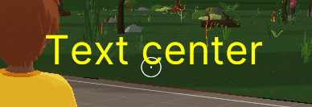

When instancing, you can pass the following parameters:

- `value: string`: String to display.
- `duration: number = 3`: Time to keep the text visible (in seconds). If set to -1, the announcement will remain on screen till it's hidden.
- `color: Color4 = Color4.Yellow()`\*: Text color, as a `Color4`.
- `size: number = 50`\*: Font size.
- `xOffset: number = 0`\*: Offset from the center on the X axis.
- `yOffset: number = 0`\*: Offset from the center on the Y axis.
- `startHidden: boolean = true`: If true, the announcement starts invisible till you run its `show()` function.

> Note: options marked with `*` can later be changed by accessing the relevant properties of the created announcement.

```ts
const announcement = new ui.Announcement({
  value: 'Text center',
  startHidden: false,
  duration: 5,
  color: Color4.Red(),
  size: 50,
  xOffset: 100,
  yOffset: -50,
})
```

After creating, `Announcement` has methods to control visibility:

- `hide(): void`: Hides the announcement.
- `show(): void`: Shows the announcement (that will be automatically hidden after the specified `duration`).

```ts
pointerEventsSystem.onPointerDown(
  myEntity,
  () => {
    announcement.show()
  },
  {
    button: InputAction.IA_PRIMARY,
    hoverText: 'Show announcement',
  }
)
```

Announcement components that you can interact with:

- `textElement: EntityPropTypes & UiLabelProps`: Props for the underlying `Label` text component.

## Counter

To display a number on a corner of the screen that can be easily updated, you can create a `UICounter`.

```ts
const ammo = new ui.UICounter({ value: 123 })

// ...

ammo.render('player-ammo')
```

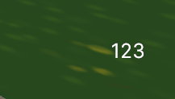

When instancing a new counter you can pass the following parameters:

- `value: number`: Numeric starting value.
- `xOffset: number = -40`\*: Offset on X away from the bottom-right corner.
- `yOffset: number = 70`\*: Offset on Y away from the bottom-right corner.
- `color: Color4 = Color4.White()`\*: Text color.
- `size: number = 25`\*: Text size.
- `fixedDigits: number = 0`\*: Number of digits to use, `0` allows any digits number.
- `startHidden: boolean = true`: If true, the counter starts invisible till you run its `show()` function.

> Note: options marked with `*` can later be changed by accessing the relevant properties of the created counter.

```ts
const ammo = new ui.UICounter({
  value: 123,
  startHidden: false,
  xOffset: -50,
  yOffset: 100,
  color: Color4.Black(),
  size: 35,
  fixedDigits: 2,
})

//

ammo.xOffset = -100
```

Once a `UICounter` object is instanced, you can call the following functions on it:

- `read(): number`: Returns the current value of the counter.
- `increase(amount?: number): void`: Increases the number by a given amount. If no parameters are passed, it raises the value by 1.
- `decrease(amount?: number): void`: Decreases the number by a given amount. If no parameters are passed, it lowers the value by 1.
- `set(amount: number): void`: Sets the number to a given amount, no matter what the previous value was.
- `show(): void`: Shows the counter.
- `hide(): void`: Hides the counter.

```ts
pointerEventsSystem.onPointerDown(
  myEntity,
  () => {
    if (ammo.read() <= 0) {
      return
    }

    ammo.decrease()
  },
  {
    button: InputAction.IA_PRIMARY,
    hoverText: 'Click',
  }
)
```

Counter components that you can interact with:

- `textElement: EntityPropTypes & UiLabelProps`: Props for the underlying `Label` text component.

## Corner Labels

To display text on the bottom-left corner of the screen, you can create a `CornerLabel`.

```ts
const healthLabel = new ui.CornerLabel({ value: 'Health: ' })

/// ...

healthLabel.render('health-label')
```

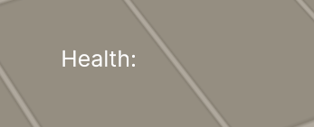

When instancing a new corner label you can pass the following parameters:

- `value: string | number` - Text to show.
- `xOffset: number = -70`\*: Offset on X, relative to the bottom-right corner.
- `yOffset: number = 40`\*: Offset on Y, relative to the bottom-right corner.
- `color: Color4 = Color4.White()`\*: Text color.
- `size: number = 25`\*: Text size.
- `startHidden: boolean = true`: If true, the label starts invisible till you run its `show()` function.

> Note: options marked with `*` can later be changed by accessing the relevant properties of the created label.

```ts
const healthLabel = new ui.CornerLabel({
  value: 'Health: ',
  xOffset: -300,
  yOffset: 70,
  color: Color4.Black(),
  size: 30,
  startHidden: false,
})

//

healthLabel.color = Color4.White()
```

After the `CornerLabel` is being instanced, you can call this methods:

- `hide(): void`: Hides the label.
- `show(): void`: Shows the label.

```ts
pointerEventsSystem.onPointerDown(
  myEntity,
  () => {
    healthLabel.hide()
  },
  {
    button: InputAction.IA_PRIMARY,
    hoverText: 'Exit game',
  }
)
```

Label components that you can interact with:

- `textElement: EntityPropTypes & UiLabelProps`: Props for the underlying `Label` text component.

## Bar

To display a bar that can be updated to increase or shorten in length, similar to a typical health bar in games, you can create a `UIBar`.

```ts
const health = new ui.UIBar({ value: 0.5 })

/// ...

health.render('player-health')
```

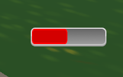

When instancing a new bar you can pass the following parameters:

- `value: number`: Starting value of the bar, from 0 to 1. With 1 the bar is full, with 0 it's empty.
- `xOffset: number = -30`\*: Offset on X away from the bottom-right corner.
- `yOffset: number = 60`\*: Offset on Y away from the bottom-right corner.
- `color: Color4: Color4.Red()`\*: Color of the bar filling.
- `style: BarStyles = BarStyles.ROUNDSILVER`\*: Margin style of the bar, from a list of different predetermined options in different colors and shapes. It takes a value from the `BarStyles` enum.
- `scale: number = 1`\*: Multiplier to alter the size of the bar proportionally. A scale of 1 = 128 x 32 pixels.
- `startHidden: boolean = true`: If true, the bar starts invisible till you run its `show()` function.

> Note: options marked with `*` can later be changed by accessing the relevant properties of the created progress bar.

```ts
const health = new ui.UIBar({
  value: 1,
  xOffset: -30,
  yOffset: 130,
  color: Color4.Red(),
  style: ui.BarStyles.ROUNDSILVER,
  scale: 1,
})

//

health.scale = 1.25
```

Once a `UIBar` object is instanced, you can call the following functions on it:

- `read(): number`: Returns the current value of the counter.
- `increase(amount?: number): void`: Increases the number by a given amount. If no parameters are passed, it raises the value by 0.1.
- `decrease(amount?: number): void`: Decreases the number by a given amount. If no parameters are passed, it lowers the value by 0.1.
- `set(value: amount): void`: Sets the bar to a given value, no matter what the previous value was.
- `hide(): void`: Hides the bar.
- `show(): void`: Shows the bar.

```ts
pointerEventsSystem.onPointerDown(
  myEntity,
  () => {
    health.decrease(0.1)
    if (health.read() <= 0) {
      // die
    }
  },
  {
    button: InputAction.IA_PRIMARY,
    hoverText: 'Hit',
  }
)
```

Progress bar components that you can interact with:

- `barElement: EntityPropTypes`: Props for the underlying `UiEntity` wrapper component.
- `backgroundElement: EntityPropTypes`: Props for `UiEntity` component that is responsible for the background.
- `processElement: EntityPropTypes`: Props for `UiEntity` component that is responsible for displaying the progress.

## Corner Icons

To display an icon of on the bottom-left corner of the screen you can create one of the following:

- `Icon`: generic component that accepts `size` parameter.
- `SmallIcon`: by default 32x32 pixels in size.
- `MediumIcon`: by default 64x64 pixels in size.
- `LargeIcon`: by default 128x128 pixels in size.

```ts
const mediumIcon = new ui.MediumIcon({ image: 'images/scene-thumbnail.png' })
mediumIcon.show()

/// ...

mediumIcon.render('scene-thumbnail-icon')
```


When instancing a new icon you can pass the following parameters:

- `image: string`\*: Path to the image file.
- `xOffset: number = -30`\*: Offset on X, relative to the bottom-right corner.
- `yOffset: number = -50`\*: Offset on Y, relative to the bottom-right corner.
- `width?: number`\*: Image width on screen in pixels. Default value depends on icon's type (`32` for `SmallIcon`, `64` for `MediumIcon` and `128` for `LargeIcon`).
- `height?: number`\*: Image height on screen in pixels. Default value depends on icon's type (`32` for `SmallIcon`, `64` for `MediumIcon` and `128` for `LargeIcon`).
- `size: 'small' | 'medium' | 'large'`: Icon sizes. **Available only for `Icon`**.
- `section?: ImageAtlasData`\*: Use only a section of the image file, useful when arranging multiple icons into an image atlas. This field takes an `ImageAtlasData` object, specifying `sourceWidth`, `sourceHeight`, `sourceLeft`, `sourceTop`, `atlasWidth` and `atlasHeight`.
- `startHidden: boolean = true`: If true, the icon starts invisible till you run its `show()` function.

> Note: options marked with `*` can later be changed by accessing the relevant properties of the created icon.

```ts
const ammoIcon = new ui.SmallIcon({
  image: 'images/ammo32.png',
  xOffset: -70,
  yOffset: 70,
  startHidden: false,
})

const healthIcon = new ui.MediumIcon({
  image: 'images/heart64.png',
  xOffset: -170,
  yOffset: 120,
})

//

ammoIcon.yOffset = 50
```

After the icon is being instanced, you can call this methods to manipulate it's visibility:

- `hide(): void`: Hides the icon.
- `show(): void`: Shows the icon.

Icon components that you can interact with:

- `imageElement: EntityPropTypes`: Props for the underlying `UiEntity` image component.

## Loading icon

To display a loading icon on the center of the screen for a specified amount of time, create a `LoadingIcon`.

```ts
const loading = new ui.LoadingIcon({ duration: 3 })

// ...

loading.render('loading-icon')
```


When instancing a new loading icon, you can pass the following parameters:

- `duration: number = 0`: seconds to display the image onscreen. If not set, or set to 0, it keeps the icon on till you hide it.
- `xOffset: number = 0`\*: Offset on X, relative to the center of the screen.
- `yOffset: number = 0`\*: Offset on Y, relative to the center of the screen.
- `scale: number = 1`\*: Multiplier to alter the size of the icon proportionally. A scale of 1 = 50 x 66 pixels.
- `startHidden: boolean = true`: If true, the icon starts invisible till you run its `show()` function.

> Note: options marked with `*` can later be changed by accessing the relevant properties of the created loading icon.

```ts
const loading = new ui.LoadingIcon({
  duration: 3,
  xOffset: 0,
  yOffset: 40,
  scale: 0.5,
  startHidden: false,
})

//

loading.scale = 0.75
```

Once a `LoadingIcon` object is instanced, you can call this methods:

- `hide(): void`: Hides the icon.
- `show(): void`: Shows the icon.

Loading icon components that you can interact with:

- `imageElement: EntityPropTypes`: Props for the underlying `UiEntity` image component.

## Large image

To display a large image on the center of the screen for a specified amount of time, create a `CenterImage`. By default images must be 512 x 512 pixels, unless specified.

```ts
const largeImage = new ui.CenterImage({ image: 'images/Burn.png' })

// ...

largeImage.render('burn-image')

// ...

largeImage.show()
```

When instancing a new large image, you can pass the following parameters:

- `image: string`\*: Path to image file.
- `duration: number`: Seconds to display the image onscreen. -1 keeps it on till you hide it.
- `xOffset: number = 0`\*: Offset on X, relative to the center of the screen.
- `yOffset: number = 0`\*: Offset on Y, relative to the center of the screen.
- `width: number = 512`\*: Image width on screen in pixels.
- `height: number = 512`\*: Image height on screen in pixels.
- `section?: ImageAtlasData`\*: Use only a section of the image file, useful when arranging multiple images into an image atlas. This field takes an `ImageAtlasData` object, specifying `sourceWidth`, `sourceHeight`, `sourceLeft`, `sourceTop`, `atlasWidth` and `atlasHeight`.
- `startHidden: boolean = true`: If true, the image starts invisible till you run its `show()` function. Large images may flash white for a second if created and shown at the same time. By deferring the creation you avoid this artifact.

> Note: options marked with `*` can later be changed by accessing the relevant properties of the created image.

```ts
const gameOver = new ui.CenterImage({
  image: 'images/Burn.png',
  duration: 3,
  startHidden: true,
  xOffset: 0,
  yOffset: 0,
  width: 512,
  height: 512,
  section: {
    sourceHeight: 512,
    sourceWidth: 512,
    sourceLeft: 0,
    sourceTop: 0,
    atlasWidth: 1,
    atlasHeight: 1,
  },
})

gameOver.show()
```

Once a `CenterImage` object is instanced, you can call the following functions on it:

- `show(): void`: Shows the image.
- `hide(): void`: Hides the image.

Large image components that you can interact with:

- `imageElement: EntityPropTypes`: Props for the underlying `UiEntity` image component.

## Predefined prompt windows

The UI Utils library includes various common prompt windows to display messages and ask players to take an action.

### Ok Prompt

Displays a prompt window with a custom message and an OK button. The Ok button can either be clicked or triggered by pressing the E key.

When instancing a new Ok Prompt, you can pass the following parameters:

- `text: string`: Message string.
- `onAccept?: () => void`: Function that gets executed if player clicks the button or presses E.
- `acceptLabel: string = 'Ok'`: Label to go in the accept button.
- `useDarkTheme: boolean = false`: Switch the style of the window to the dark theme.
- `width: number = 400`: Width of the prompt.
- `height: number = 250`: Height of the prompt.
- `onClose?: () => void`: If provided, a callback function that fires when the prompt is closed via the (X) button.
- `startHidden: boolean = true`: If true, the prompt starts invisible till you run its `show()` function.

```ts
const prompt = new ui.OkPrompt({
  text: 'This is an Ok Prompt',
  onAccept: () => {
    log('accepted')
  },
  acceptLabel: 'Ok',
  useDarkTheme: true,
  width: 450,
  height: 300,
  startHidden: false,
})

// ...

prompt.render('example-ok-prompt')
```


> Note: If the player closes the window with the close icon, the related `onAccept` function isn't called.

Once a `OkPrompt` object is instanced, you can call the following functions on it:

- `show(): void`: Shows the prompt.
- `hide(): void`: Hides the prompt.

> Note: prompt will not be closed automatically after the user clicks the button or presses the E key. You should close it manually using the `hide` method.

Prompt parts that you can interact with:

- `textElement: PromptText`: Main text element of the prompt. [Learn more.](#add-text)
- `buttonElement: PromptButton`: Accept button of the prompt. [Learn more.](#add-a-button)
- `closeIcon: PromptCloseIcon`: Close icon of the prompt. [Learn more.](#customizing-close-button)

### Option Prompt

Displays a prompt window with a custom message, a title, and two buttons that perform separate actions. The buttons can be clicked or triggered by the E and F keys.

When instancing a new Option Prompt, you can pass the following parameters:

- `title: string | number`: Header at the top of the window.
- `titleSize: number = 24`: Size of the header text.
- `text: string | number`: Smaller print instructions displayed at the center of the prompt.
- `textSize: number = 21`: Size of the prompt text.
- `onAccept?: () => void`: Function that gets executed if player clicks accept (left) button or presses the E key.
- `onReject?: () => void`: Function that gets executed if player clicks reject (right) button or presses the F key.
- `acceptLabel: string = 'Yes'`: String to go in the accept button
- `rejectLabel: string = 'No'`: String to go in the reject button
- `useDarkTheme: boolean = false`: Switch the style of the window to the dark theme.
- `width: number = 400`: Width of the prompt.
- `height: number = 250`: Height of the prompt.
- `onClose?: () => void`: If provided, a callback function that fires when the prompt is closed via the (X) button.
- `startHidden: boolean = true`: If true, the prompt starts invisible till you run its `show()` function.

```ts
const prompt = new ui.OptionPrompt({
  title: 'Pick an option!',
  text: 'What will you choose?',
  acceptLabel: 'Pick A',
  rejectLabel: 'Pick B',
  onAccept: () => {
    optionPrompt.hide()
    console.log('picked option A')
  },
  onReject: () => {
    optionPrompt.hide()
    console.log('picked option B')
  },
  startHidden: false,
})

// ...

prompt.render('option-prompt')
```

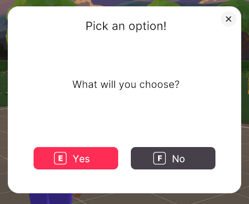

> Note: If the player closes the window with the close icon, neither of the functions are called.

Once a `OptionPrompt` object is instanced, you can call the following functions on it:

- `show(): void`: Shows the prompt.
- `hide(): void`: Hides the prompt.

> Note: prompt will not be closed automatically after the user clicks buttons or presses the E or F key. You should close it manually using the `hide` method.

Prompt parts that you can interact with:

- `titleElement: PromptText`: Title element of the prompt. [Learn more.](#add-text)
- `textElement: PromptText`: Main text element of the prompt. [Learn more.](#add-text)
- `primaryButtonElement: PromptButton`: Primary button of the prompt. [Learn more.](#add-a-button)
- `secondaryButtonElement: PromptButton`: Secondary button of the prompt. [Learn more.](#add-a-button)
- `closeIcon: PromptCloseIcon`: Close icon of the prompt. [Learn more.](#customizing-close-button)

### Fill in Prompt

Displays a prompt window with a header, a text field to fill in and a submit button. The value filled into the text box can be used as a parameter in the submit function.

When instancing a new Fill-in Prompt, you can pass the following parameters:

- `title: string | number`: Header at the top of the window.
- `titleSize: number = 24`: Size of the header text.
- `onAccept: (value: string) => void`: Function that gets executed when player clicks the button or presses the E key.
- `acceptLabel: string = 'Submit'`: String to use as label on the submit button.
- `placeholder: string = 'Fill in'`: Text to display as placeholder in the text box.
- `useDarkTheme: boolean = false`: Switch the style of the window to the dark theme.
- `width: number = 400`: Width of the prompt.
- `height: number = 250`: Height of the prompt.
- `onClose?: () => void`: If provided, a callback function that fires when the prompt is closed via the (X) button.
- `startHidden: boolean = true`: If true, the prompt starts invisible till you run its `show()` function.

```ts
const prompt = new ui.FillInPrompt({
  title: 'What are you thinking?',
  onAccept: (value: string) => {
    console.log('accepted value:', value)
  },
})
```

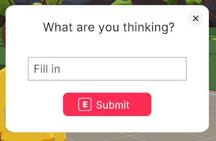

> Note: If the player closes the window with the close icon, the related function isn't called.

Once a `FillInPrompt` object is instanced, you can call the following functions on it:

- `show(): void`: Shows the prompt.
- `hide(): void`: Hides the prompt.

> Note: prompt will not be closed automatically after the user clicks the button or presses the E key. You should close it manually using the `hide` method.

Prompt parts that you can interact with:

- `titleElement: PromptText`: Title element of the prompt. [Learn more.](#add-text)
- `inputElement: PromptInput`: Input field element of the prompt. [Learn more.](#add-an-input-box)
- `buttonElement: PromptButton`: Submit button of the prompt. [Learn more.](#add-a-button)
- `closeIcon: PromptCloseIcon`: Close icon of the prompt. [Learn more.](#customizing-close-button)

## Custom Prompt Windows

Custom prompt windows let you arrange as many elements as you want into a window, including buttons, text, checkboxes, switches, textboxes and icons.

### Create a custom prompt

First create a new `CustomPrompt` object.

```ts
const prompt = new ui.CustomPrompt({ style: ui.PromptStyles.DARKSLANTED })

// ...

prompt.render('my-custom-prompt')
```

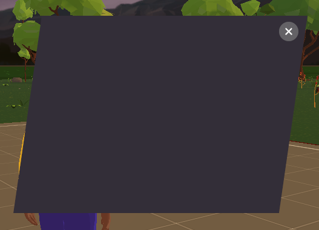

When instancing a new CustomPrompt, you can pass the following parameters:

- `style: PromptStyles = PromptStyles.LIGHT`: Pick from a few predefined options, some of them using the dark theme, others the light theme.
- `width: number = 400`: Background width on screen in pixels. The default size depends on the theme used.
- `height: number = 250`: Background height on screen in pixels. The default size depends on the theme used.
- `startHidden: boolean = true`: If true, the prompt starts invisible to load in the background till calling the `show()` function of the prompt object.
- `onClose?: () => void`: If provided, a callback function that fires when the prompt is closed via the (X) button.

> Note: Stretching the background images away from their default values may lead to blurry corners.

Once you instanced a `CustomPrompt` object, you can add elements to it by calling its various functions.

You can also call the following functions on it:

- `hide`: Hides the window.
- `show`: Shows the window if previously closed.

Access all of the UI elements that make up the prompt UI by calling the `elements` property of the prompt object.

### Customizing close button

When you're creating a prompt, it'll have a close button at the upper right corner. Anytime you can access `closeIcon` property of `PromptCloseIcon` type to change some of it's options:

- `width: number = 32`: Button width.
- `height: number = 32`: Button height.
- `xPosition: number = 10`: Offset on X from the top of the window.
- `yPosition: number = 10`: Offset on X from the right of the window.
- `onMouseDown: () => void`: Callback that is called when the user clicks on the button.

> Note: When changing the `onMouseDown`, be sure to call the `hide` method of the related popup's to close it.

Close button components that you can interact with:

- `iconElement: EntityPropTypes`: Props for the underlying `UiEntity` image component.

### Add text

To add text to a custom prompt, use the `addText` function.

```ts
const promptHeader = prompt.addText({
  value: 'Hello World!',
  xPosition: 0,
  yPosition: 100,
  size: 30,
})
```

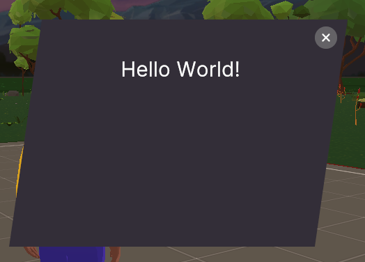

The `addText()` function can take the following parameters:

- `value: string | number`: Text to show.
- `xPosition: number`: Offset on X from the center of the window.
- `yPosition: number`: Offset on Y from the center of the window.
- `color: Color4 = Color4.Black()`: Text color.
- `size: number = 14`: Text size.
- `startHidden: boolean = false`: If true, text will be invisible till calling the `show()` function.

> Note: you can later change all of this options (except `startHidden`) by accessing the relevant properties of the created `PromptText`.

The `addText()` function returns a `PromptText` object, that you can then reference to change its values. This object has the following functions that can be called any time:

- `hide(): void`: Hides the text.
- `show(): void`: Shows the text.

Text components that you can interact with:

- `textElement: EntityPropTypes & UiLabelProps`: Props for the underlying `Label` component.

### Add a button

To add a button to a custom prompt, use the `addButton` function.

```ts
const promptButtonE = customPrompt.addButton({
  style: ui.ButtonStyles.E,
  text: 'Yeah',
  xPosition: 0,
  yPosition: 0,
  onMouseDown: () => {
    console.log('Yeah pressed')
  },
})

const promptButtonF = customPrompt.addButton({
  style: ui.ButtonStyles.F,
  text: 'Nope',
  xPosition: 0,
  yPosition: -75,
  onMouseDown: () => {
    console.log('Nope pressed')
  },
})
```

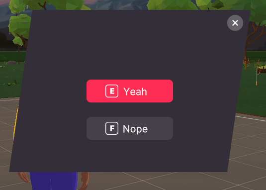

The `addButton` function can take the following parameters:

- `text: string | number`\*: Label to show on the button.
- `xPosition: number`\*: Offset on X from the center of the window.
- `yPosition: number`\*: Offset on Y from the center of the window.
- `onMouseDown: () => void`\*: Function to execute when the button is clicked.
- `style: PromptButtonStyles = PromptButtonStyles.ROUNDSILVER`: Choose out of several predefined style options, with different colors and rounded or square corners.
- `startHidden: boolean = false`: If true, the button will be invisible till calling the `show()` function.

> Note: options marked with `*` can later be changed by accessing the relevant properties of the returned `PromptButton`.

> Note: If you pick the `E` or `F` style, the buttons will also be triggered when pressing the E or F keys respectively.


The `addButton()` function returns a `PromptButton` object, that you can then reference to change its values. This object has the following functions that can be called any time:

- `hide(): void`
- `show(): void`
- `grayOut(): void`: Sets the text to gray and makes it unclickable.
- `enable(): void`: Sets the text to white and makes it clickable again.

Button components that you can interact with:

- `labelElement: EntityPropTypes`: Props for the `Label` component that is responsible for the button label.
- `imageElement: EntityPropTypes`: Props for the `UiEntity` component that is responsible for the button background image.
- `iconElement: EntityPropTypes`: Props for the `UiEntity` component that is responsible for the button icon.

### Add a Checkbox

To add a checkbox to a custom prompt, use the `addCheckbox` function.

```ts
const promptCheckbox = customPrompt.addCheckbox({
  text: "Don't show again",
  xPosition: -80,
  yPosition: 0,
  onCheck: () => {
    console.log('checkbox checked')
  },
  onUncheck: () => {
    console.log('checkbox unchecked')
  },
})
```

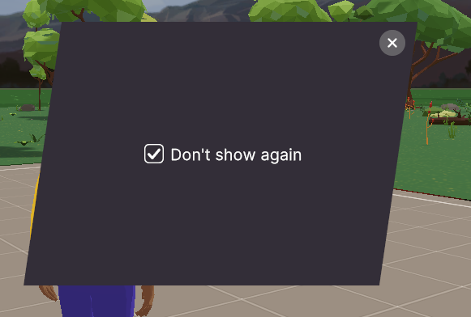

The `addCheckbox` function can take the following parameters:

- `text: string`: Label to show next to the checkbox.
- `xPosition: number`: Offset on X from the center of the window.
- `yPosition: number`: Offset on Y from the center of the window.
- `onCheck?: () => void`: Function to execute when the box is checked.
- `onUncheck?: () => void`: Function to execute when the box is unchecked.
- `large: boolean = false`: If `true`, the box size to 32 x 32.
- `startChecked: boolean = false`: If true, the box starts checked by default.
- `startHidden: boolean = false`: If true, the checkbox will be invisible till calling the `show()` function.

> Note: you can later change all of this options (except `startChecked` and `startHidden`) by accessing the relevant properties of the created `PromptCheckbox`.

The `addCheckbox()` function returns a `PromptCheckbox` object, that you can then reference to change and read its values. This object has the following functions that can be called any time:

- `hide(): void`
- `show(): void`
- `check(): void`: Sets the element to checked, **without** performing the associated function.
- `uncheck(): void`: Sets the element to checked, **without** performing the associated function.

Checkbox components and components that you can interact with:

- `imageElement: EntityPropTypes`: Props for the `UiEntity` component that is responsible for the checkbox's box image.
- `labelElement: EntityPropTypes & UiLabelProps`: Props for the `Label` component that is responsible for the checkbox label.

### Add a Switch

To add a switch to a custom prompt, use the `addSwitch` function.

```ts
const promptSwitch = customPrompt.addSwitch({
  text: 'Turn me',
  xPosition: -60,
  yPosition: 0,
  onCheck: () => {
    console.log('switch checked')
  },
  onUncheck: () => {
    console.log('switch unchecked')
  },
})
```

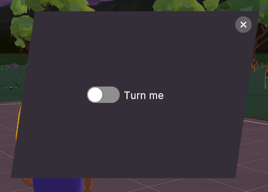

The `addSwitch` function can take the following parameters:

- `text: string`: Label to show next to the switch.
- `xPosition: number`: Offset on X from the center of the window.
- `yPosition: number`: Offset on Y from the center of the window.
- `onCheck?: () => void`: Function to execute when the switch is activated.
- `onUncheck?: () => void`: Function to execute when the switch is deactivated.
- `style: PromptSwitchStyles = PromptSwitchStyles.ROUNDGREEN`: Pick between several sizes, with different colors and rounded or square corners. The value must be from the `SwitchStyles` enum.
- `startChecked: boolean = false`: If true, the switch starts activated by default.
- `startHidden: boolean = false`: If true, the switch will be invisible till calling the `show()` function.


The `addSwitch()` function returns a `PromptSwitch` object, that you can then reference to change and read its values. This object has the following functions that can be called any time:

- `hide(): void`
- `show(): void`
- `check(): void`: Sets the element to checked, **without** performing the associated function.
- `uncheck(): void`: Sets the element to checked, **without** performing the associated function.

Switch has components that you can interact with:

- `imageElement: EntityPropTypes`: Props for the `UiEntity` component that is responsible for the switch icon.
- `labelElement: EntityPropTypes & UiLabelProps`: Props for the `Label` component that is responsible for the switch label.

### Add an icon

To add an icon to a custom prompt, use the `addIcon` function.

```ts
const promptIcon = customPrompt.addIcon({
  image: 'images/scene-thumbnail.png',
})
```

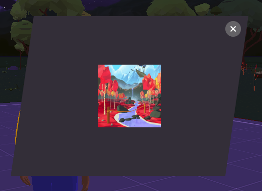

The `addIcon` function can take the following parameters:

- `image: string`: Path to the image file.
- `xPosition: number = 0`: Offset on X, relative to the window's center.
- `yPosition: number = 0`: Offset on Y, relative to the window's center.
- `width: number = 128`: Image width on screen in pixels.
- `height: number = 128`: Image height on screen in pixels.
- `section?: ImageAtlasData`: Use only a section of the image file, useful when arranging multiple icons into an image atlas. This field takes an `ImageAtlasData` object, specifying `sourceWidth`, `sourceHeight`, `sourceLeft`, `sourceTop`, `atlasWidth` and `atlasHeight`.
- `startHidden: boolean = false`: If true, the switch will be invisible till calling the `show()` function.

> Note: you can later change all of this options (except `startHidden`) by accessing the relevant properties of the returned `PromptIcon`.

The `addIcon()` function returns a `PromptIcon` object, that you can then reference to change its values. This object has the following functions that can be called any time:

- `hide(): void`
- `show(): void`

Icon components that you can interact with:

- `imageElement: EntityPropTypes`: Props for the underlying `UiEntity` component.

### Add an input box

To add an input box to a custom prompt, use the `addTextBox` function.

```ts
const promptTextBox = customPrompt.addTextBox({
  placeholder: 'Enter text',
  xPosition: 0,
  yPosition: 0,
  onChange: (value) => {
    console.log('textbox changed', value)
  },
})
```

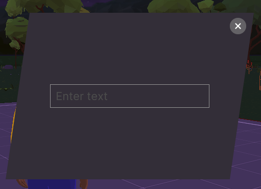

The `addTextBox` function can take the following parameters:

- `xPosition: number`: Offset on X, relative to the window's center.
- `yPosition: number`: Offset on Y, relative to the window's center.
- `placeholder: string | number = 'Fill in'`: Text to display in the input box before the player interacts with it.
- `onChange?: (value: string) => void`: Function that gets executed every time the player edits the content on the input box, once for each character changed.
- `startHidden: boolean = false`: If true, the switch will be invisible till calling the `show()` function.

> Note: you can later change all of this options (except `startHidden`) by accessing the relevant properties of the returned `PromptInput`.

The `addTextBox()` function returns a `PromptInput` object, that you can then reference to change and read its values. This object has the following functions that can be called any time:

- `hide(): void`
- `show(): void`

You can access the last edited value on the textbox by fetching the `currentText` value of the returned object.

Input components that you can interact with:

- `fillInBoxElement: EntityPropTypes & Partial<UiInputProps>`: Props for the underlying `Input` component.

### Full Custom UI example

Here's a full example of a custom UI:

```ts
export const customPrompt = new ui.CustomPrompt({
  style: ui.PromptStyles.DARKSLANTED,
  height: 600,
})

const promptTitle = customPrompt.addText({
  value: 'What will you do?',
  xPosition: 0,
  yPosition: 250,
  color: Color4.Yellow(),
  size: 30,
})

const promptText = customPrompt.addText({
  value: "It's an important decision",
  xPosition: 0,
  yPosition: 200,
})

const promptCheckbox = customPrompt.addCheckbox({
  text: "Don't show again",
  xPosition: -80,
  yPosition: 150,
  onCheck: () => {
    console.log('checkbox checked')
  },
  onUncheck: () => {
    console.log('checkbox unchecked')
  },
})

const promptSwitch = customPrompt.addSwitch({
  text: 'Turn me',
  xPosition: -60,
  yPosition: 50,
  onCheck: () => {
    console.log('switch checked')
  },
  onUncheck: () => {
    console.log('switch unchecked')
  },
})

const promptTextBox = customPrompt.addTextBox({
  placeholder: 'Enter text',
  xPosition: 0,
  yPosition: 100,
  onChange: (value) => {
    console.log('textbox changed:', value)
  },
})

const promptButtonE = customPrompt.addButton({
  style: ui.ButtonStyles.E,
  text: 'Yeah',
  xPosition: 0,
  yPosition: -150,
  onMouseDown: () => {
    console.log('Yeah clicked')
  },
})

const promptButtonF = customPrompt.addButton({
  style: ui.ButtonStyles.F,
  text: 'Nope',
  xPosition: 0,
  yPosition: -225,
  onMouseDown: () => {
    console.log('Nope clicked')
  },
})

const promptIcon = customPrompt.addIcon({
  image: 'images/scene-thumbnail.png',
  xPosition: 0,
  yPosition: -50,
})

customPrompt.show()

// ...

customPrompt.render('my-custom-prompt')
```

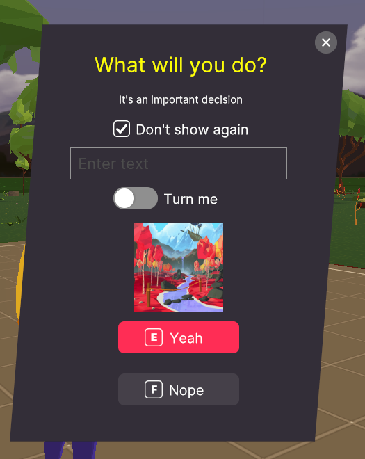

---

## Contribute

In order to test changes made to this repository in active scenes, do the following:

1. Build the project by running `npm run build`
2. Run `npm run link` on this repository
3. On the scene directory, after you installed the dependency, run `npm link @dcl-sdk/ui-utils`

## CI/CD

This repository uses `semantic-release` to automatically release new versions of the package to NPM.

Use the following convention for commit names:

`feat: something`: Minor release, every time you add a feature or enhancement that doesn’t break the api.

`fix: something`: Bug fixing / patch

`chore: something`: Anything that doesn't require a release to npm, like changing the readme. Updating a dependency is **not** a chore if it fixes a bug or a vulnerability, that's a `fix`.

If you break the API of the library, you need to do a major release, and that's done a different way. You need to add a second comment that starts with `BREAKING CHANGE`, like:

```
commit -m "feat: changed the signature of a method" -m "BREAKING CHANGE: this commit breaks the API, changing foo(arg1) to foo(arg1, arg2)"
```
